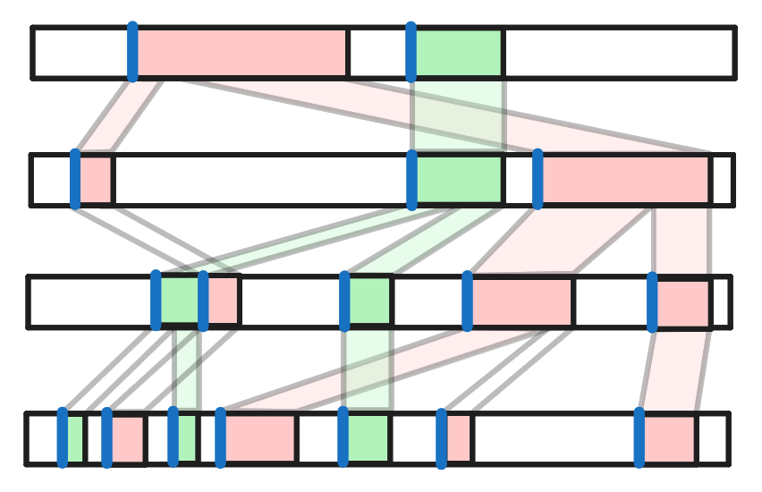

Day 5 presented us with a bunch of mappings (seed -> soil, soil -> fertilizer, ..., humidity -> location). We had to put a bunch of seed values through this mapping to find their locations and get the smallest location

# Part 1

I used [nom](https://docs.rs/nom/latest/nom/) here for parsing the input

I noticed that the mappings are sequential in the input, so I just needed to go through each map top to bottom

I created a `map_value` method on the `Mapping` struct which looped through each mapping line and if the value was within the mapping range, it mapped it, otherwise, it went onto the next line. If it reached the end, it just returned the original number

After mapping each seed, I found the smallest location - the puzzle answer

# Part 2

This part was really tricky. Instead of the seed inputs being numbers, they were a list of starting points and ranges. These were very large ranges though (e.g. 1,034,516,675), so it was not possible to brute force each seed anymore.

I considered creating a single piecewise function of mappings from seed to location by calculating how each range mapped through the next (just keeping track of the start of the range and its length, instead of all contained values). I was having difficulty getting this working, so opted for a simpler solution.

The idea was to see where the start of each range ended up as a location. As the numbers always increase within a range, we know that the start of each range will be the smallest. We can then loop through the locations where these points end up, reverse map them back to a seed value, and find the first seed which lies in the input seed range

1. Go through each mapping, and keep track of the start of each range in the mapping
2. Map these starts to the next category, and repeat until getting to location
3. We now have a list of all the starting points of each mapping range (in the location "realm")
4. Loop through each of these starting points (in ascending order), map them back to a seed. The first one that lies within the input seed range is the smallest location

In the diagram below, you can see the seed ranges at the top (in green and red), and then each full bar is a different category (e.g. seed or location). At each stage, you can see where the range maps to. The blue lines represent the start of each range - the values we keep track of. I haven't drawn them going back up the stages because that would clutter the image

